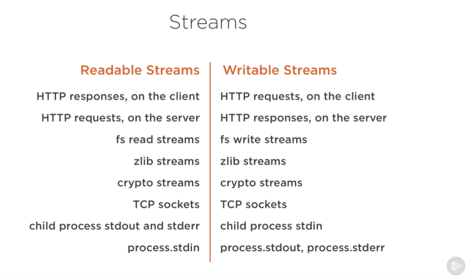

# Streams

Streams are one of the more difficult concepts to grasp in `Node`. Streams enable us to `send` and `receive` data in `sections` called `chunks`. When we do so without using a `stream` we send the whole thing as a single `chunk`. This is fine if we are sending small amounts of data, but what if we want to send a 2TB file? what if we want to send a million rows worth of content from our `database`? that is where `streams` become not only useful, but often essential.

Think of this, when we send a chunk to the `receiver` (for arguments sake lets say this is a `file` upload to our `server`) we upload our `file`, it is sent to the server and held in `RAM`. Now lets say our machine  has the following specification:

Server

| Name | Description |
| --- | --- |
| SSD | 2TB |
| RAM | 16GB |

Lets say our `file` is `1TB` in size, For one, uploading all of this content may be incredibly slow if we don't have a reliable and fast network connection, however, the bigger concern is that we are about to run out of `memory`.

If we continue, our server will begin receiving `packets` from our network. This will be unpacked as one large `chunk`. Even if no other process is running on our `server` (obviously it will be), we cannot handle `1TB` being stored in our `RAM`, as such, we will receive a `memory error` as our sytem runs out of `RAM` to hold our data in a single upload.

So, if we can't hold a large `chunk` like this in `memory` then what is the solution? realistically we want to send many, much smaller, `chunks` rather than one large one. One way we can do this is to send these `chunks` split from the `data` on the client side, another approach would be to split the `chunks` as we receive them in `RAM`, then the moment we receive a chunk of a certain size (lets say `4GB`) we immediately write it to the `disk`, clear up the `RAM` and repeat the process until we have all `1TB` of data saved to our `disk`.

What `streams` enable us to do is similar to this. `Streams` take `chunks` of data and allow us to `process` it prior to `receiving`. You can imagine this like a `pipe` of flowing water, we don't know how much water is flowing, maybe not even when it will finish, but we can manipulate it as it is in the process of transitioning location.

You have seen `streams` before even if you don't realise it. Whenever you watch a video online, whenever you listen to music, whenever you play an entirely online game, there is a reason it's referred to as `streaming`.

 

 

# Uploading Vs Streaming

Lets say we want to send a file again. One way we can do this is to use the `fs` module to send the whole file:

In this case we read the file in memory, we would then send this to our `server`. This is the first situation we discussed, which again, is fine if you have a small amount of data, but in most cases we want the means of sending much larger amounts of `data`. `Streaming` also prevents us locking up our `memory` for long periods, meaning `streams` are much better for performance.

In Node we have four types of streams:

1. <strong>Readable</strong>
2. <strong>Writeable</strong>
3. <strong>Duplex</strong>
4. <strong>Transform</strong>

A `readable` is a `stream` where you are only allowed to read from the source. Think of this, as a kind of `straw` to the watering hole, you can drink from it, but you can't add to the `source` from it. `Writeable` is the opposite to this, with a `writeable` you cannot see the data as it is streaming, you can only add to it. A `duplex` on the other hand allows you to both `read` from and `write` to the `stream`. Lastly, a `transform` allows us to manipulate the `stream`, this is kind of a `function` which manipulates our data in the `stream` as it passes through it. To keep with our water analogy, you can think of this as a `Dam` or any other kind of `facility` which would manipulate either the `flow` of the water or the `content`. In node, much like in life, `streams` run through `pipes` (we will get through this without needing to pee I swear...). `Pipes` can be thought of as our main transport system. In `Node` we use the `pipe` command to `connect` streams, this allows us to join multiple `flows` and expand functionality of a basic `stream` (Phew!).

So! back to our file example. To use a `stream` in `Node` we would first create our `stream`, we then write this to our `socket stream`, we can actually take a `read` and a `write` stream and pipe them both together to meet desired functionality.

 

# Streams are Water then?

Yes! well... No! but kind of... yeah we talked about water a lot here, but that is because for any `abstraction` we make our brains need a `concrete` example to picture in order to think it through.

`Streams` are actually just `collections` of `data`, just like `arrays`, just like `strings`, the difference with `streams` is that the data might not all be available at once. As we have previously alluded to, this can be great for sending large amounts of data, however, `streams` are not only a solution to `big data` problems!

`Streams` give us far greater compatibility in our code. Just like we can compose powerful `Linux` commands by piping together smaller commands, we can do exactly the same using `Node`. Many of our built-in modules implement the `streaming interface`:

Notice the relation of these `streams`. For instance, our `HTTP stream` is `readable` on the `client`, yet on the `server` it is piped to a `writeable` stream. This because we read from one `object` (`http.IncomingMessage`) and write to another (`http.ServerResponse`).

Try diving into the `code` in here, as with anything in `engineering` you will get a better idea of using `streams` by playing with them!

# Code

In our code you will notice we are using a simple `Node` application. This is completely vanilla `Node`, as we want to focus on the `core` concept of `streams`.
In our first two lines you will notice we declare our first few constants.

If you have never worked with `Node` as a `CLI` application before you may never have seen this. Here we are reading in arguments from the `CLI`, as you are likely already aware, to run a node application we use `node <script>`, anything we declare after this will be added to `process.argv`, which already contains the directory paths as the first two `arguments`. here we slice those two to get only the `arguments` we want access toand set the `path` constant to be equivalent to the first `argument`.

We then have basic `error` handling in case our `args` are too great or too small in number, this is purely for demonstration purposes. Our first section of note when it comes to `streams` is the `createHugeFile` function, which uses a `writeStream` to write a large amount content to a `file`.

We could write a server to read this file using the `fs` module. Since we are using an `async` function we aren't blocking the `event loop` so everything should be fine.

<pre>
<code>
const fs = require('fs');
const server = require('http').createServer();

server.on('request', (req, res) => {
    fs.readFile('./bigfile.txt', (err, data) => {
        if (err) throw err;

        res.end(data);
    })
});

server.listen(3200);
</code>
</pre>

Try monitoring your memory however and you will see a very different story. When we start the `server` the amount of `RAM` consumed will spike,this is because we are reading the whole of this file into memory at once. As discussed earlier, this is incredibly inefficient, and we'd be better off handling this with a `stream` of smaller `chunks`.

To define what happened a little more accurately, we read the content of our `file` into `memory` prior to it being wrote to the `response` object. If we want to make this more efficient, we can do so. Recall that the `HTTP response object` is also a `writeable stream`. This means that if we have a `readable stream` we can `pipe` the two streams on one another and achieve a similar result without consuming all of our `memory`.

All `streams` are instances of `EventEmitter`, as such, they work in the same manner. `Streams` emit `events` that can be used to `read` and `write` data. However, `pipe` also offers a simpler way to use the `pipe` method.

<pre>
<code>
readableSrc.pipe(writableDest);
</code>
</pre>

In this one line we can `pipe` the `output` of a `readable stream` - the source of data, as an input of the `writeable` - the destination. The source must be a `readable stream` and the `destination` must be a `writable stream`. We can even chain `pipe` calls if we are `piping` into a `Duplex Stream`, just like we do when writing `Linux` commands.

 

<pre>
<code>
readableSrc
  .pipe(transformStream1)
  .pipe(transformStream2)
  .pipe(finalWrtitableDest)
</code>
</pre>

 

The pipe method returns the `destination stream`, here is another example, first we will define our streams:

<ol type="A">
  <li>Readable</li>
  <li>Duplex</li>
  <li>Duplex</li>
  <li>Writeable</li>
</ol>

<pre>
<code>
a.pipe(b).pipe(c).pipe(d)

# Which is equivalent to:
a.pipe(b)
b.pipe(c)
c.pipe(d)

# Which, in Linux, is equivalent to:
$ a | b | c | d
</code>
</pre>

It is generally accepted that `pipe` is the easiest way to consume `streams`, or to consume them with `events` but avoid mixing the two methods, usually when using `pipe` you don't need to use `events`, but if you need to consume your `streams` in more custom ways, then you should use `events` instead.

Rememeber

You can remember stream order as such:

| Stream | Definition |
| --- | --- |
| Readable | Data Source |
| Writeable | Save Destination |

 

# Stream Events

The `pipe` method may be the easiest way to work with `streams`, but it is not the only way. Sometimes, you need more control over your `streams`, you need to customise it's behaviour to a greater degree.

The `pipe` method handles a few things for us; `error handling`, `end-of-file`, `synchronisation`.

We can write the `event-equivalent` code of the `pipe` method.

<pre>
<code>
# readable.pipe(writable)

readable.on('data', (chunk) => {
  writable.write(chunk);
});

readable.on('end', () => {
  writable.end();
});
</code>
</pre>

We can use these any of the following `events` with `streams`:

 

Important Events

 

#### Readable Stream

- The `data event`, which is `emitted` whenever the `stream` passes a `chunk` of `data` to the `consumer`.

- The end `event`, which is `emitted` when there is no more `data` to be consumed from the `stream`.The end `event`, which is `emitted` when there is no more `data` to be consumed from the `stream`.

#### Writeable Stream
- The `drain` event, which is a `signal` that the writable `stream` can receive more `data`.

- The finish `event`, which is `emitted` when all data has been flushed to the underlying system.

`Events` and `functions` can be combine to make for a `custom` and optimised use of `streams`. In consuming `readable strams` we can use `pipe/unpipe`, `read/unshift/resum` methods. For `writeable streams` we can make it the destination for `pipe/unpipe` or write it to the `write` method and call the `end` method when we are done.

 

# Paused or Flowing

`Readable streams` have two main modes that affect how we consume them.

- They can be paused
- They can be flowing

sometimes, these are referred to as `pull` and `push` modes. All `readable streams` begin as `paused`, but can be switched to `flowing` and back as needed, sometimes, this switching even happens automatically.

When a `readable stream` is `paused` we can use the `read` function to read from the `stream`, however, when it is `flowing` we must listen to `events` in order to consume it.

In `flowing` mode data can actually be lost if no `consumers` are available to handle it, this is why when we have a `readable stream` in `flowing` mode we need a `data` event handler. Simply adding a `data` event handler switches a `paused stream` into `flowing` mode, removing the `data` event handler switches it back to `paused` mode. We can also manually switch between `streams` using `resume/pause` functions.

 

# Implementing Streams

When talking about `streams` in `Node`, there are two tasks we want to know how to do. The foremost is how we `implement` them and the latter is how we `consume` them.
Thus far we have discussed `consuming` streams, now we will `implement` them.

`Modules` which `implement` the `stream` module are usually referred to as `stream implementers`. To implement a `writable stream` we need to use the `Writable` constructor.

<pre>
<code>
const { Writable } = require('stream');
</code>
</pre>

We can `implement` these `streams` in many ways, we can simply `require` a `stream` and create a new instance of `Writable` from it's constructor. Or we can `extend` a `class` and use `inheritance`.

<pre>
<code>
const { Writable } = require('stream');

const outStream = new Writable({
  write(chunk, encoding, callback) {
    console.log(chunk.toString());
    callback();
  }
});

process.stdin.pipe(outStream);
</code>
</pre>

- The chunk is usually a buffer unless we configure the stream differently.
- The encoding argument is needed in that case, but usually we can ignore it.
- The callback is a function that we need to call after we’re done processing the data chunk. It’s what signals whether the write was successful or not. To signal a failure, call the callback with an error object.